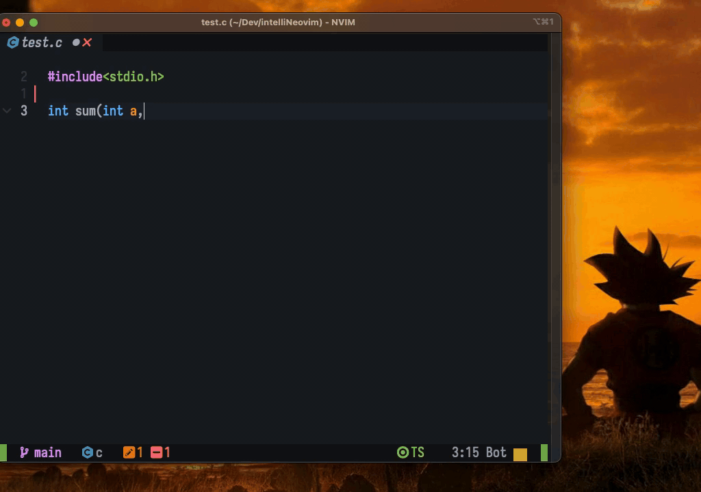

# opilot.nvim
Open source Co-pilot clone for Neovim 

AI assistant for neovim

 

# LLM Model in use:
codellama from hugging face is a good open source model but not as good as gpt3.5/4

OpenAi api can be used (Much better performance and accuracy) but not open source.

Todo:
- [x] Autocomplete on demand (Formatting and bugs)
- [x] Generate tests on demand (Basic function. Needs a lot of formatting)
- [ ] Generate documentation on demand
- [ ] Explain code
