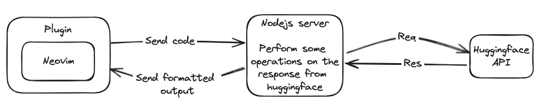

# opilot.nvim
Open source Co-pilot clone for Neovim. I am using codellama 13b as the main model here. 

AI coding assistant for neovim

## Architecture
I am currently using a middleware microservice type system to send and recieve code from the hugginface api as I was having trouble directly making a request.

heres a rough sketch of what I tried implementing (It may seem an overhead, but it was working, so I didnt touch)

# LLM Model in use:
codellama from hugging face is a good open source model but not as good as gpt3.5/4

OpenAi api can be used (Much better performance and accuracy) but not open source.

Todo:
- [x] Autocomplete on demand (Formatting and bugs)
- [x] Generate tests on demand (Basic function. Needs a lot of formatting)
- [ ] Generate documentation on demand
- [ ] Explain coderch

